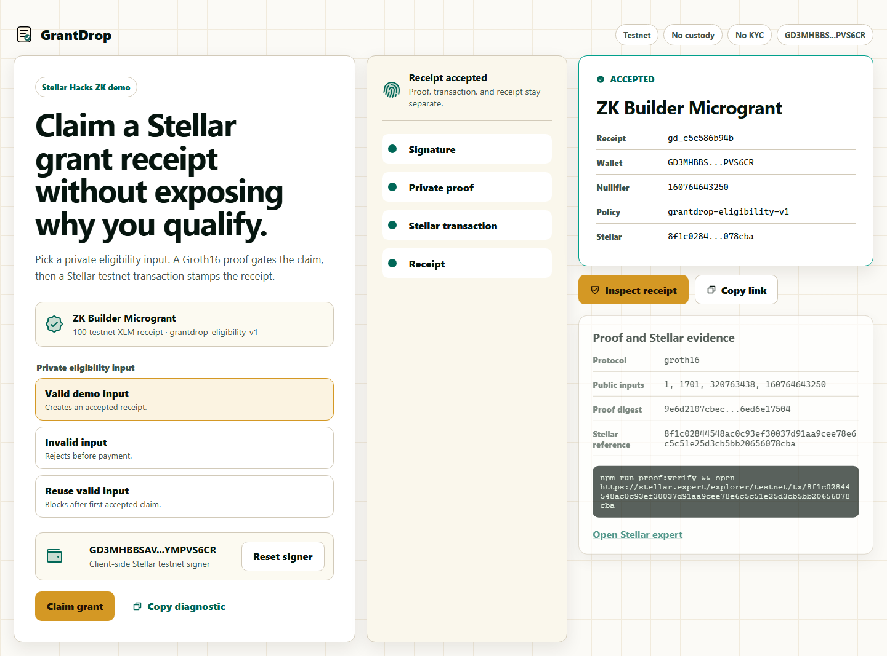

# GrantDrop

A grant claimant chooses a private eligibility input, signs with a Stellar testnet signer, and receives a reopenable receipt with a Groth16 proof digest and Stellar transaction link.



## Try it in 60 seconds

- Live URL: https://grantdrop-stellar-zk.pages.dev
- First click: open `/campaigns/zk-builder-microgrant`, use the testnet signer, then click `Claim grant`.
- Result: an `ACCEPTED` receipt opens at `/receipts/gd_c5c586b94b?r=...`.
- Inspect: click `Inspect receipt` to see public inputs, proof digest, and the Stellar Expert transaction link.

## What it does

GrantDrop gives a grant program a public receipt without putting the private eligibility fact on screen.

- Input: valid, invalid, or repeated private eligibility selection.
- Action: the claimant signs with a browser-created Stellar testnet signer.
- Result artifact: a receipt with status, wallet, nullifier, public proof inputs, proof digest, and Stellar tx reference.
- Reopen path: the copied receipt URL carries the public receipt payload, so a fresh browser can open the same receipt without a signer.

## How it works

- ZK gate: `src/services/proof.ts` builds the witness input, runs `snarkjs.groth16.fullProve`, verifies with `public/proofs/verification_key.json`, and keeps the private secret off the receipt.
- On-chain verification: `src/services/contract.ts` submits the proof to a deployed Soroban Groth16 verifier contract that runs the native BN254 pairing check (Stellar Protocol 25 host functions, CAP-0074) and enforces eligibility by checking the public `secretSquare` commitment. Contract: `CA7KNPNRCI7I4RRWRJ4H5BJP4SLKPUEWJYSLYH4HWJTOVEDR7FEFU2X2`.
- Stellar path: `src/services/stellar.ts` creates a client-side testnet signer, funds it through Friendbot, signs a `manageData` transaction, and returns a Stellar Expert URL.
- Receipt state: `src/services/receiptStore.ts` stores receipts in IndexedDB for return visits and encodes public receipt fields into the shared URL.
- One-claim guard: accepted receipts are indexed by nullifier, so the same nullifier returns an already-claimed receipt.

## Evidence

- Soroban verifier contract: `contracts/grantdrop_verifier/` — `cargo test` passes 4/4 (valid claim accepted; tampered proof / wrong secret / wrong wallet rejected). Deployed to testnet: `CA7KNPNRCI7I4RRWRJ4H5BJP4SLKPUEWJYSLYH4HWJTOVEDR7FEFU2X2`.
- Deploy tx: `e8c33a455a41390dce6d26ac8501de145937d9f7b2a1deb989ff931dd7550062` (Stellar Expert).
- Circuit: `circuits/grantdrop.circom` — non-degenerate Groth16; public signals `[nullifier, secretSquare, campaignId, walletBinding]` are bound by quadratic constraints so tampered signals fail verification.
- Public smoke report: `.hunter/public-smoke.report.json`
- Desktop success screenshot: `docs/assets/grantdrop-desktop-accepted.png`
- Mobile success screenshot: `docs/assets/grantdrop-mobile-accepted.png`
- Second-context reopen screenshot: `docs/assets/grantdrop-second-context.png`
- Public chain checks: `.hunter/public-chain-verification.json`
- Verified claims: `.hunter/claim-matrix.json`
- Proof command: `npm run proof:verify`

Latest public smoke txs:

- Desktop: `8f1c02844548ac0c93ef30037d91aa9cee78e6c5c51e25d3cb5bb20656078cba`
- Mobile: `0c41c4eafa4ec8f110ac32fd3783ac4252e3bc1378b7a246759234c0d2703960`

## Run locally

```bash
npm install
npm run build
npm run preview -- --host 127.0.0.1 --port 4173
```

Verification:

```bash
npm run proof:verify
node scripts/audit-runtime-stable.mjs . --url http://127.0.0.1:4173
```

## Limits

- GrantDrop ships one fixed testnet campaign: `zk-builder-microgrant`.
- It uses Stellar testnet only. No custody, no mainnet funds, no KYC provider.
- Friendbot or Horizon outages show a failed receipt instead of marking a claim accepted.
- The shared receipt URL contains public receipt fields: status, wallet, nullifier, proof digest, public inputs, and tx reference. It does not contain the private eligibility secret.
