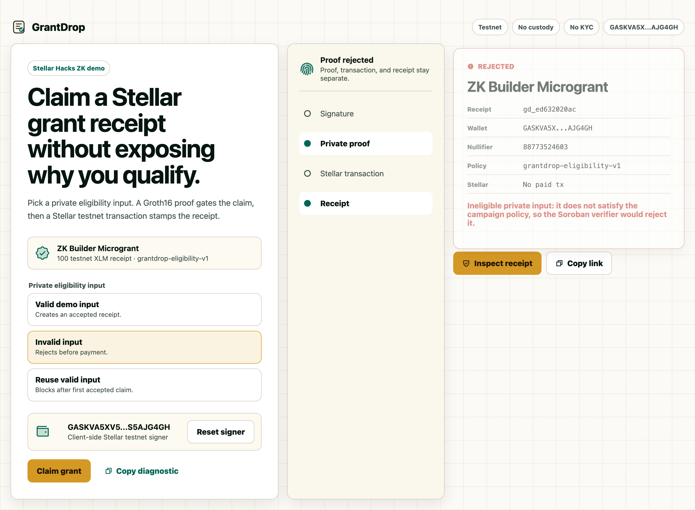
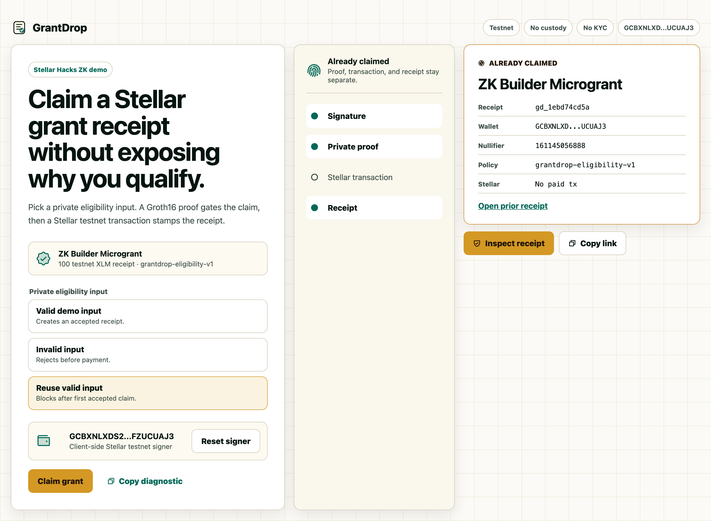
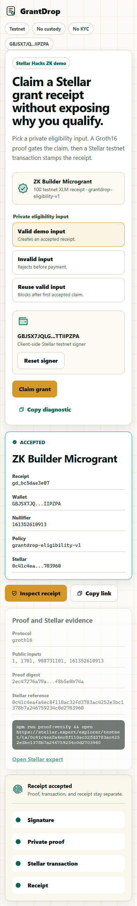
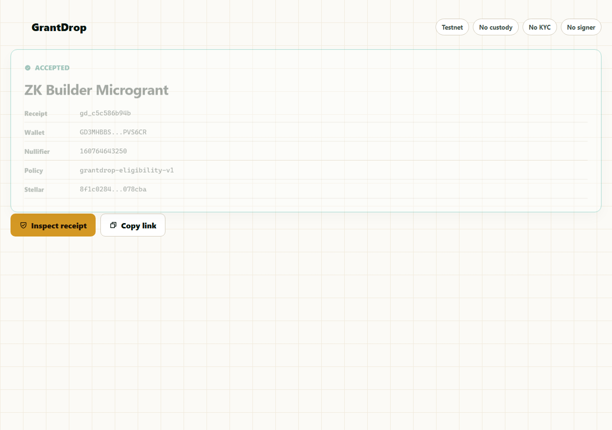
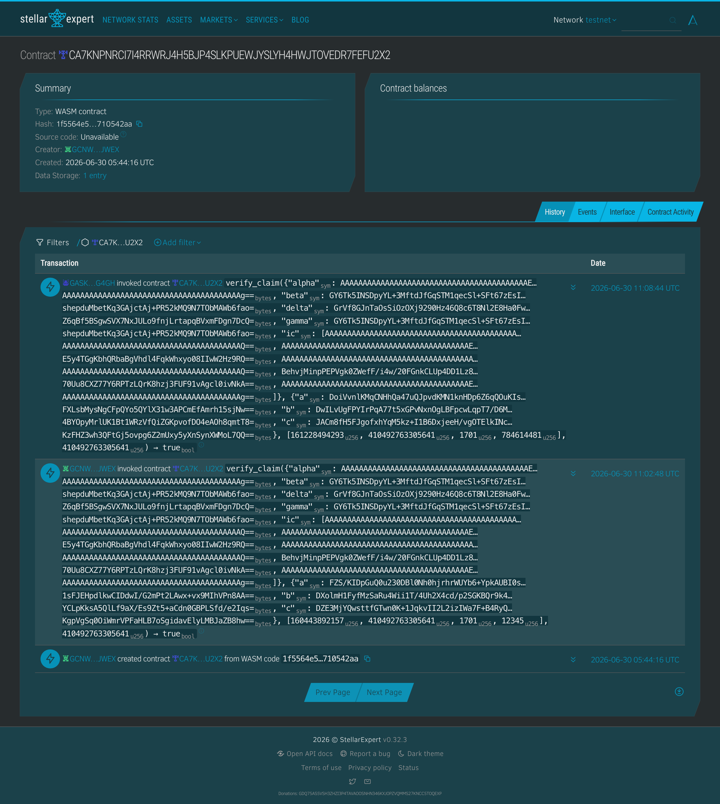

# GrantDrop

A proof-gated grant receipt system on Stellar. Eligible builders generate a Groth16 zero-knowledge proof in their browser, have it verified on-chain by a Soroban contract, and receive an inspectable receipt — all without exposing the private eligibility fact.

[](https://grantdrop-stellar-zk.pages.dev)
[](https://stellar.expert/explorer/testnet/contract/CA7KNPNRCI7I4RRWRJ4H5BJP4SLKPUEWJYSLYH4HWJTOVEDR7FEFU2X2)


## Try it

1. Open [grantdrop-stellar-zk.pages.dev](https://grantdrop-stellar-zk.pages.dev)
2. Navigate to the `zk-builder-microgrant` campaign
3. Connect with the browser testnet signer (auto-funded via Friendbot)
4. Click **Claim grant** → a Groth16 proof is generated and verified on-chain
5. View your `ACCEPTED` receipt with proof digest, on-chain tx hash, and Stellar Expert link

The receipt URL is shareable — paste it in a fresh browser to reopen without signing.

## What it does

| Step | What happens | Where to verify |
|------|-------------|-----------------|
| **Proof** | Browser generates a Groth16 proof; private eligibility never leaves the device | `src/services/proof.ts` |
| **On-chain gate** | A Soroban contract runs the BN254 pairing check; claim accepted only if it returns true | `contracts/grantdrop_verifier/` |
| **Receipt** | Status, wallet, nullifier, public inputs, proof digest, and tx links | `docs/assets/grantdrop-desktop-accepted.png` |
| **Replay** | Copy the receipt URL → open in another browser → same receipt, no signer needed | `docs/assets/grantdrop-second-context.png` |

## Architecture

```
┌──────────────┐   Groth16 proof    ┌──────────────────┐   verify_claim    ┌─────────────┐
│   Browser    │ ──────────────────▶│  Soroban Contract │ ─────────────────▶│  Receipt    │
│  (snarkjs)   │                    │  (BN254 pairing)  │                   │  (IndexedDB │
│              │ ◀───────────────── │                   │ ◀──────────────── │   + URL)    │
│  Private     │   verification     │   True/False      │   accepted/reject │             │
│  eligibility │                    │                   │                   │             │
└──────────────┘                    └──────────────────┘                   └─────────────┘
```

- **Circuit**: `circuits/grantdrop.circom` — non-degenerate Groth16; public signals `[nullifier, secretSquare, campaignId, walletBinding]` bound by quadratic constraints.
- **Verifier contract**: `contracts/grantdrop_verifier/src/lib.rs` — Rust Soroban contract using Stellar Protocol 25 host functions (CAP-0074) for native BN254 pairing.
- **Client**: Vite + React + TypeScript, deployed on Cloudflare Pages.

## Evidence

### On-chain

- **Soroban verifier**: `CA7KNPNRCI7I4RRWRJ4H5BJP4SLKPUEWJYSLYH4HWJTOVEDR7FEFU2X2` (testnet)
- **Deploy tx**: `e8c33a45...` ([Stellar Expert](https://stellar.expert/explorer/testnet/tx/e8c33a455a41390dce6d26ac8501de145937d9f7b2a1deb989ff931dd7550062))
- **verify_claim invocations**: see [`docs/evidence/onchain-verification.json`](docs/evidence/onchain-verification.json)

### Tests

```bash
cd contracts/grantdrop_verifier && cargo test
# 4/4: valid claim accepted; tampered proof / wrong secret / wrong wallet / wrong binding rejected
```

### Screenshots

| Accepted | Invalid | Reuse |
|----------|---------|-------|
|  |  |  |

| Mobile | Second context | Contract |
|--------|---------------|----------|
|  |  |  |

## Run locally

```bash
npm install
npm run build
npm run preview -- --host 127.0.0.1 --port 4173
```

Verify proofs:

```bash
npm run proof:verify
node scripts/audit-runtime-stable.mjs . --url http://127.0.0.1:4173
```

## Tech stack

Stellar testnet · Soroban · Groth16 (Circom + snarkjs) · Rust · BN254 (CAP-0074) · React · TypeScript · Vite · Cloudflare Pages · IndexedDB

## License

MIT
